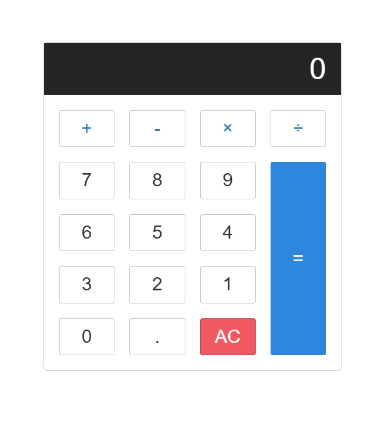

# Simple Calculator
Basit matematiksel işlemleri yapabileceğiniz bir hesap makinesi uygulaması.

## Proje Konusu

Bu proje, kullanıcıların hızlı ve kolay bir şekilde dört temel matematiksel işlemi yapabilmelerini sağlayan bir **hesap makinesi uygulamasıdır**. Kullanıcılar toplama, çıkarma, çarpma ve bölme işlemlerini gerçekleştirebilirler.

## Neden Geliştirildi : Motivasyon

Bu uygulamayı geliştirme motivasyonum: **JavaScript becerilerimi geliştirmek ve temel bir uygulama ile DOM manipülasyonunu pekiştirmek** istedim.

## Ne Öğrendim?

Bu projeyi geliştirirken aşağıdaki konularda bilgi ve deneyim kazandım:

- **HTML, CSS, JavaScript** ile temel bir uygulama geliştirme.
- **DOM manipülasyonu** ile kullanıcı etkileşimlerine dinamik yanıtlar verme.
- **Event Listener** kullanarak butonlar arası etkileşim sağlama.
- Hesaplamalar için **JavaScript'te temel algoritma geliştirme**.
- Tasarım ve düzenlemeler için **CSS becerilerini pekiştirme**.

 ## Kullanılan Teknolojiler

Bu projede aşağıdaki teknolojiler ve araçlar kullanılmıştır:

- **HTML**: Yapıyı oluşturmak için.
- **CSS**: Uygulama tasarımını geliştirmek için.
- **JavaScript**: İşlevsellik ve kullanıcı etkileşimi sağlamak için.

## Ekran Görüntüleri

